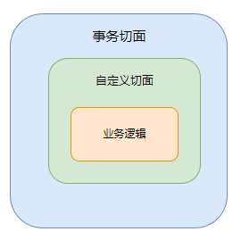

# 声明式事务
使用@Transactional注解

## @Transactional注解失效情况及解决方法
1、 当方法中出现检查型异常时（如FileNotFindException），注解失效。  
原因：Spring 默认只会回滚非检查异常。  
解决方法：配置**rollbackFor**属性
`@Transactional(rollbackFor = Exception.class)`

2、业务方法内自己 **try-catch** 异常导致事务不能正确回滚  
原因：事务通知只有捉到了目标抛出的异常，才能进行后续的回滚处理，如果目标自己处理掉异常，事务通知无法知悉。  
解决方法： 
- 解法1：异常原样抛出  
在 catch 块添加 `throw new RuntimeException(e);`
- 解法2：手动设置 `TransactionStatus.setRollbackOnly()`  
在 catch 块添加 `TransactionInterceptor.currentTransactionStatus().setRollbackOnly();`

3、@Transactional注解只能在public修饰的方法下使用  

4、AOP切面顺序导致事务不能正确回滚  
原因：事务切面优先级最低，导致自定义切面会比事务切面先拦截目标方法
解决方法：
- 在自定义切面中抛出异常，如情况2的解法1，这样事务可以捕获到异常做事务回滚
- 如情况2的解法2，手动设置事务回滚  
- 自定义切面上加上`@Order(数字)`注解，如`@Order(Ordered.LOWEST_PRECEDENCE - 1)`,其中数字越小，优先级越高，越先执行(不推荐)

  

5、父子容器导致的事务失效（待验证）

6、同一个类中方法调用，导致@Transactional失效  
原因：本类调用的方法没有走代理，导致事务失效。因为只有当事务方法被当前类以外的代码调用时，才会由Spring生成的代理对象来管理  
解决方法：
- 通过 `AopContext.currentProxy()` 拿到代理对象，来调用本类方法，并在该类上加注解`@EnableAspectJAutoProxy(proxyTargetClass = true, exposeProxy = true)`
- 是否可以改变事务传播行为让事务不失效？？？

7、@Transactional 没有保证原子行为  
原因：事务的原子性仅涵盖 insert、update、delete、select … for update 语句，select 方法并不阻塞

8、@Transactional 方法导致的`synchronized`失效